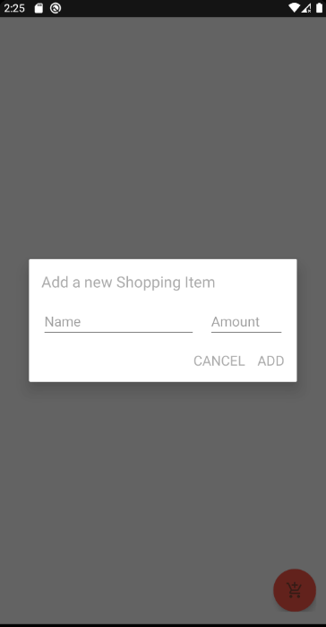
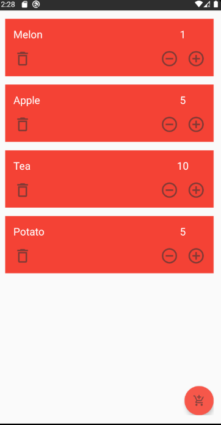

# ShoppingList
A project to demonstrate the architectural pattern of MVVM for an android application.

## Used libraries:
* Kodein for dependency injection
* Room for database
* Kotlin Coroutines
* Material Design

 
